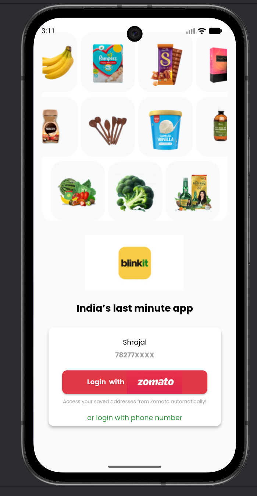
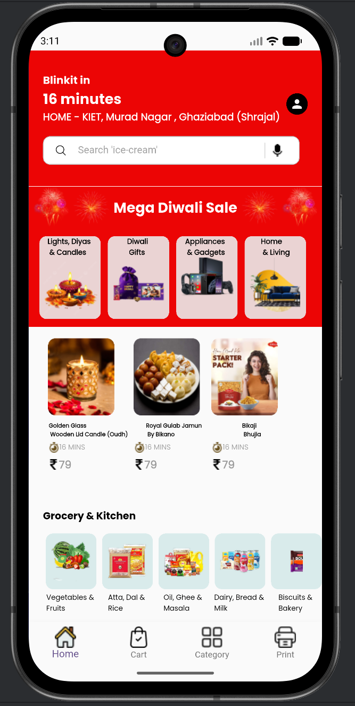
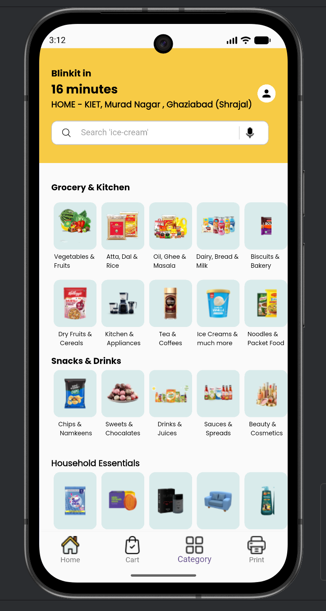
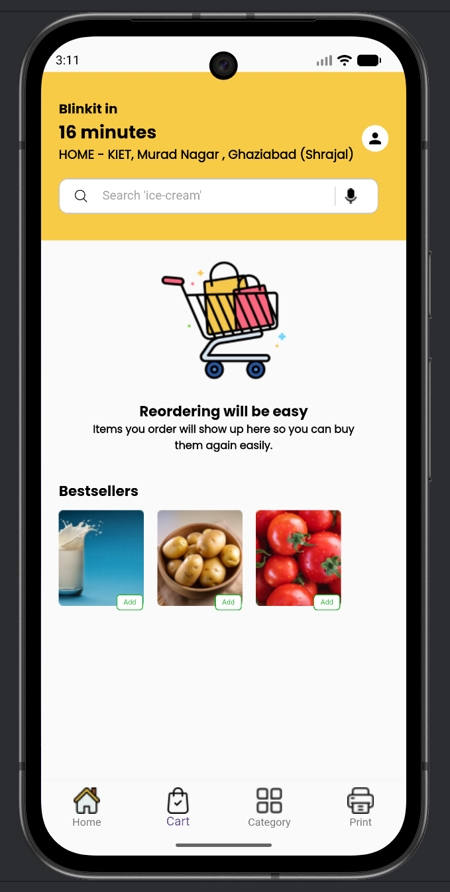
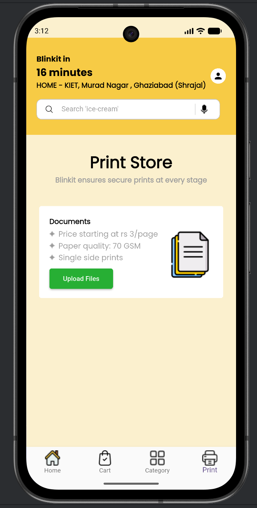

# Blinkit Flutter UI Clone

A Flutter UI clone of the Blinkit grocery delivery app created as my first hands-on Flutter project.

## About the Project
After learning Dart and understanding Flutter fundamentals from official documentation, I built this project to practice real-world UI development.  
Instead of blindly copying, I implemented every screen myself while following a reference video for guidance.

Although the reference video was 2.5 hours long, it took me around 12–14 hours because I focused on understanding each widget and layout.

## Screens Implemented
- Splash Screen
- Login Screen
- Home Screen
- Category Screen
- Cart Screen
- Print Store (custom feature)

## App Preview

| Splash | Login | Home |
|------|------|------|
|  |  |  |

| Category | Cart | Print Store |
|------|------|------|
|  |  |  |

## Tech Stack
- Flutter
- Dart

## Future Improvements
- State management (Provider)
- Working cart logic
- Authentication flow
- Backend integration

## Getting Started
Clone the repository and run

## Author

**Shrajal**  
[GitHub](https://github.com/shrajal01)

